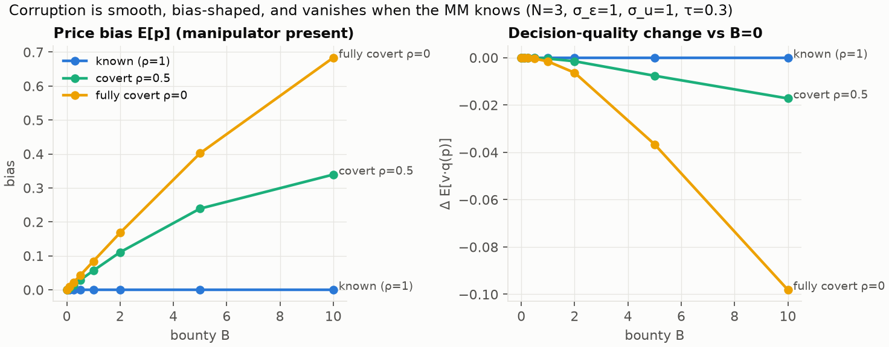
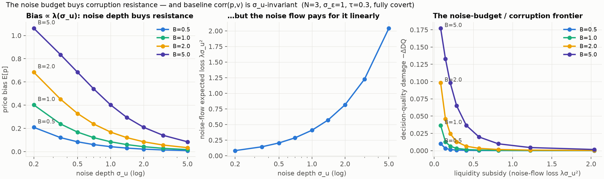
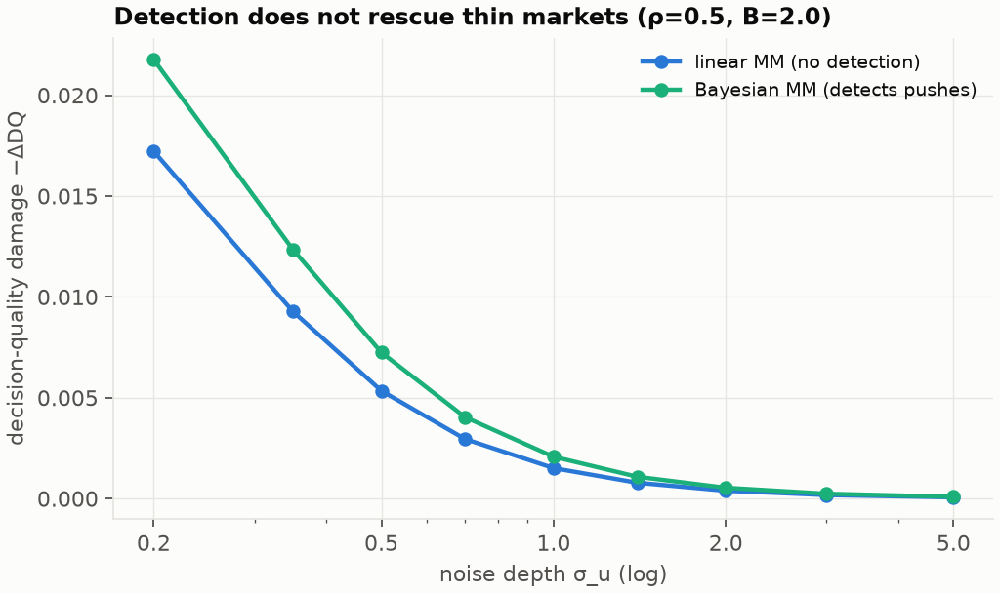
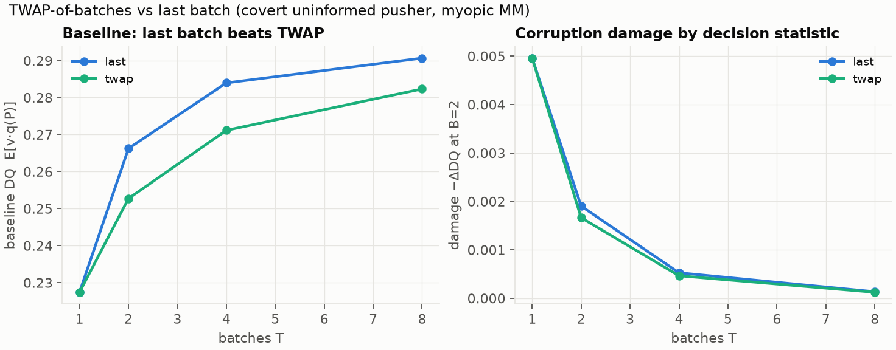
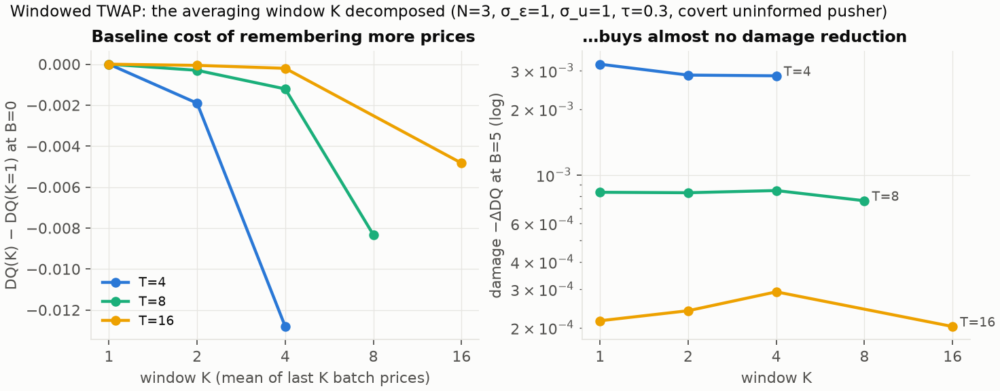
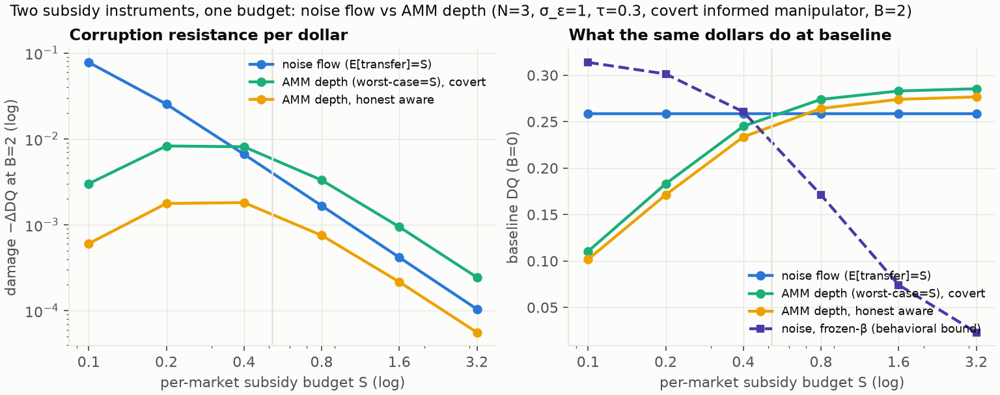
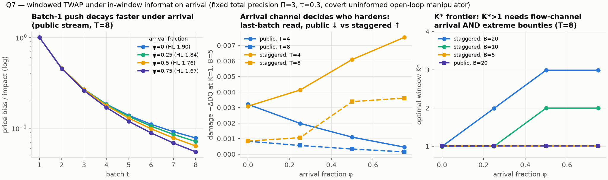

# Corruption in Kyle-style simultaneous batch decision markets

**Question.** The CFR sweeps in [`../MANIPULATION.md`](../MANIPULATION.md) measured how much outside bounty a *sequential, discrete, small* decision market absorbs before decisions degrade. This subproject asks the same question for the opposite market microstructure — a **one-shot batch auction cleared by a competitive market maker** (Kyle 1985), with continuous prices, Gaussian information, and a smooth probabilistic decision rule — where the theory can be done analytically and every mechanism can be swept cheaply. The point is to learn which of the CFR findings are *general* and which are artifacts of sequential trading, discrete grids, or tabular strategy spaces.

**Headline.** In batch + outcome-settled markets, corruption is a **smooth price bias, not a threshold and not information destruction** — and its size is governed by a single dial. The bias a bounty *B* buys is

&nbsp;&nbsp;&nbsp;&nbsp;E[p] − 0 = λ · (1−ρ)/(2−ρ) · B · E[q′(p)],

where λ is Kyle's price impact, ρ is the market maker's prior that the briber is present, and q′ is the decision rule's slope. Since λ = √(cN(1−c(N+σ_ε²)))/σ_u while the baseline price *distribution* (and hence corr(p,v) and baseline decision quality) is **invariant to σ_u**, the noise budget σ_u buys corruption resistance at a linear subsidy cost with **zero aggregation cost**. That tradeoff — the noise-budget/corruption frontier — is quantified below (§ Frontier). Note the direction: distortion scales with **B·q′·λ**, i.e. *large* λ (thin noise) is the vulnerable regime. The prediction in the task brief (distortion ∼ B·q′/λ, "resistance is bought with λ, λ is bought by shrinking σ_u") is **inverted** by the equilibrium: pushing the price by Δ costs the manipulator ≈ Δ²/λ, so illiquidity is the manipulator's friend, and resistance is bought by *raising* σ_u.

All results are affine-strategy equilibria validated by Monte Carlo and by unilateral-deviation tests (sup over **all** strategies, not just a grid — see § Validation). Reference: Kyle (1985), *Continuous Auctions and Insider Trading*, Econometrica 53(6). The N-trader simultaneous version follows the multi-informed static Kyle tradition (Holden–Subrahmanyam-style competition [verify — derived from scratch here and verified symbolically/numerically; the attribution, not the math, is the unverified part]).

---

## Model

* Quality v ~ N(0,1). One proposal per market.
* N informed traders, signals s_i = v + ε_i, ε_i ~ N(0, σ_ε²) i.i.d.
* One batch: traders simultaneously submit market orders x_i(s_i); noise flow u ~ N(0, σ_u²).
* Competitive MM observes only net flow y = Σx_i + u and sets p = E[v|y] (linear projection; an exact nonlinear Bayesian MM is solved separately for the covert case).
* **Decision layer:** proposal approved with probability q(p) = 1/(1+e^{−p/τ}) (logistic; τ sensitivity reported).
* **Settlement:** outcome-settled — every trader's market payoff is x_i(v − p), regardless of the decision. (Deliberate: this isolates the corruption channel from settlement endogeneity, which the repo's LLM decision-market results flag as a separate amplifier — a flipped decision that also settles the book in the briber's favor is a strictly worse regime than the one studied here.)
* **Manipulator:** trader 1 also receives B·1[approved], so it maximizes E[x₁(v−p) + B·q(p)].
* **Presence belief ρ:** MM and honest traders believe the manipulator is present with probability ρ (ρ=1 common knowledge, ρ<1 covert). A second variant (T2u analog) makes the entrant always present but *bribed* with probability ρ vs honest-type.

**Equilibrium concept.** All traders play affine strategies x = a + b·s; the MM plays the best linear rule p = λ(y − μ) under its belief (μ absorbs the anticipated push). Honest best responses are *exactly* affine (their conditional problem is quadratic), so the restriction binds only on the manipulator, whose bounty term makes the true best response nonlinear; the resulting error is measured, not assumed away (§ Validation). Solved by damped fixed point; manipulator's affine best response by exact-gradient root finding (Gauss–Hermite quadrature for all q-expectations).

**Code:** `src/kyle_batch/{closed_forms,decision,onebatch,mc,twap,arrival}.py`; sweeps `scripts/{run_sweeps,run_windowed,run_subsidy,run_arrival}.py`; raw outputs `results/*.json`; tests `tests/` (42 assertion-heavy tests, all green).

## Validation discipline

Every equilibrium reported below passes:

1. **Monte Carlo agreement** (2·10⁶ draws): all analytic moments (bias, corr(p,v), decision quality, every P&L) within 4 standard errors.
2. **Grid deviation test** (MC, common random numbers, 21×21 affine grid of half-width 0.5 around equilibrium, n = 4·10⁵): max estimated gain 0 within MC noise for every role at every spot checked.
3. **Sup deviation test** (dominates any grid): the deviator's conditional problem is solved *pointwise in the signal* — closed form for honest traders, 1-d numerical optimization + quadrature for the manipulator — giving the exact supremum over all measurable strategies.

Bounds across all reported tables: **honest traders ≤ 10⁻²²** (affine BR is exact); **manipulator's nonlinear sup gain ≤ 0.17% of its equilibrium payoff for B ≤ 2 at reference depth, ≤ 0.38% across the Q6 subsidy grid (worst: thin noise, S=0.2), ≤ 1.1% for B ≤ 5, ≤ 2.6% at B = 10** (worst case ρ=1, B=10). The Q4/Q4b multi-round attacker is an exact open-loop optimum (stationarity ‖∇U‖ < 10⁻⁷ asserted in-solver, 1200 random-perturbation deviation checks in `test_windowed.py`, MC agreement at every T). The affine equilibria are near-equilibria of the unrestricted game at these tolerances; the manipulator's unexploited nonlinear margin is to push *more when the decision is marginal*, which would add a small state-dependent distortion on top of the results below.

---

## Q1 — Baseline (B = 0): closed form

Let ρ_v = 1/(1+σ_ε²) and c ≡ λβ = ρ_v/(2+(N−1)ρ_v). Then

&nbsp;&nbsp;&nbsp;&nbsp;**λ = √(cN(1 − c(N+σ_ε²)))/σ_u, β = c/λ, Var(p) = Cov(v,p) = cN, corr(p,v) = √(cN),**

total informed profit = λσ_u² (= the noise flow's expected loss; the MM breaks even). Kyle's single-insider case (N=1, σ_ε=0): λ = 1/(2σ_u), β = σ_u, corr = √½ — recovered exactly. Re-derived symbolically with SymPy (`closed_forms.sympy_derivation`) and verified by MC (`tests/test_baseline.py`).

Two structural facts drive everything later:

* **σ_u-invariance of information.** β scales with σ_u so that the price distribution — corr(p,v), Var(p), and hence baseline decision quality — does not depend on σ_u at all. Noise depth affects only *transfers* (informed profits ∝ σ_u) and *price impact* (λ ∝ 1/σ_u).
* **Aggregation improves in N and degrades in σ_ε** via corr = √(cN) → 1 as N → ∞.

Decision quality DQ = E[v·q(p)] (expected quality conditional on approval, times approval rate); oracle (approve iff v>0) = 1/√(2π) ≈ 0.3989; the best any logistic-τ rule can do on a perfect price is 0.3528 (τ=0.3). Hard-threshold market rule gives corr(p,v)·0.3989.

| N | σ_ε | λ | β | corr(p,v) | DQ (logistic τ=.3) | DQ (hard thr.) | profit/seat |
|---|---|---|---|---|---|---|---|
| 1 | 1.0 | 0.354 | 0.707 | 0.500 | 0.140 | 0.200 | 0.354 |
| 2 | 1.0 | 0.400 | 0.500 | 0.632 | 0.196 | 0.252 | 0.200 |
| 3 | 0.5 | 0.430 | 0.516 | 0.816 | 0.274 | 0.326 | 0.143 |
| 3 | 1.0 | 0.408 | 0.408 | 0.707 | 0.227 | 0.282 | 0.136 |
| 3 | 2.0 | 0.323 | 0.258 | 0.500 | 0.140 | 0.200 | 0.108 |
| 5 | 1.0 | 0.395 | 0.316 | 0.791 | 0.263 | 0.315 | 0.079 |
| 10 | 1.0 | 0.344 | 0.224 | 0.877 | 0.300 | 0.350 | 0.034 |
| 20 | 1.0 | 0.275 | 0.158 | 0.933 | 0.324 | 0.372 | 0.014 |

(σ_u = 1 shown; corr, DQ identical for all σ_u; λ and profit scale as 1/σ_u and σ_u. Full grid incl. σ_ε ∈ {0.5,1,2} × σ_u ∈ {0.5,1,2} × τ ∈ {0.1,0.3,1}: `results/baseline.json`. MC spot checks agree to <4 s.e.; deviation bounds: honest sup ≤ 10⁻²³.)

---

## Q2 — Corruption

### The manipulator's FOC and the neutralization result

With the bounty, trader 1's first-order condition gains a Bλ·E[q′(p)|s₁] term. In affine strategies the fixed point satisfies (verified to 10⁻⁵ relative in `test_manipulator_foc_identity`):

&nbsp;&nbsp;&nbsp;&nbsp;**α_m·(2−ρ) = B·E[q′(p)], bias|present = λ(1−ρ)α_m, bias|absent = −λρα_m.**

A **linear–quadratic/probit approximation** gives the closed form α_m ≈ (B/(2−ρ))·κ/√(2π(1+κ²·cN)) with κ = √(π/8)/τ (moment-matched probit); at (N=3, σ_ε=1, τ=0.3) it overestimates the exact logistic quadrature by ~13% (probit–logistic tail mismatch), so the tables use exact quadrature and the closed form is for intuition: **push ∝ B·q′(0)-ish, independent of λ; price bias ∝ λ·B·q′**.

The ρ=1 row is a theorem-grade result (`test_known_manipulator_full_neutralization`):

> **Neutralization.** If the manipulator's presence is common knowledge (ρ=1), the affine equilibrium has the manipulator push α_m = B·E[q′(p)] and the MM subtract exactly that push. Price bias = 0, β_m = β_h = the (N+1)-honest baseline β, λ unchanged, decision quality unchanged, approval probability exactly ½, and the manipulator's trading P&L equals its honest-seat value — *at every bounty B*. The briber pays B/2 in expectation and buys nothing.

This is the batch-market version of the CFR result "the equilibrium defence is to discount the manipulator" — with a crucial difference. In the discrete sequential game, discounting a trader's *moves* deletes their *information* (prices park at the no-signal posterior; "blind"). In the linear-Gaussian batch market the MM can subtract the known **mean** push while keeping the manipulator's **signal weight** β_m fully intact: **subtraction ≠ exclusion**. Outcome settlement is what makes the push a pure intercept — the manipulator still wants its signal traded profitably, so its slope stays honest, and the additive bribe response is fully separable and fully predictable.

### Covert corruption is a smooth bias

With ρ < 1 the un-subtracted residual λ(1−ρ)α_m survives as a price bias, and the *absent/honest* state inherits the mirror-image suspicion discount −λρα_m. N=3, σ_ε=σ_u=1, τ=0.3, informed manipulator (full table incl. ρ=0.5: `results/corruption.json`):

**ρ = 0 (fully covert: MM and honest traders price as if no manipulator):**

| B | α_m | price bias | ΔDQ | Δ manip trading P&L | Δ honest profit (each) | approval |
|---|---|---|---|---|---|---|
| 0 | 0 | 0 | 0 | 0 | 0 | 0.500 |
| 0.1 | 0.021 | +0.008 | −0.00002 | −0.0002 | +0.00001 | 0.503 |
| 0.5 | 0.103 | +0.042 | −0.0004 | −0.0044 | +0.0003 | 0.517 |
| 1 | 0.207 | +0.084 | −0.0016 | −0.0175 | +0.0012 | 0.535 |
| 2 | 0.411 | +0.168 | −0.0064 | −0.0697 | +0.0047 | 0.570 |
| 5 | 0.985 | +0.402 | −0.0366 | −0.414 | +0.0251 | 0.669 |
| 10 | 1.674 | +0.684 | −0.0981 | −1.248 | +0.0595 | 0.784 |

(Deviation bounds this table: honest ≤ 10⁻²³; manipulator nonlinear sup gain ≤ 0.15% of its payoff for B≤1, ≤ 0.35% for B≤5. MC agreement verified at B=1.)



Answers to the comparison questions:

* **Threshold or smooth?** *Smooth everywhere.* ΔDQ ∝ bias² ∝ B² at small B (the first-order term vanishes because E[v·q′(p)] ∝ E[q″] = 0 at the symmetric baseline), with no safe region and no saturation cliff. The CFR sharp threshold (exactly zero effect below bonus ≈ 0.02, full information exclusion above) does **not** reproduce; it is an artifact of discrete strategy/price grids, where the bounty must exceed the cost of one grid step before anything moves.
* **Blind or biased?** *Biased, not blind.* At ρ=0, corr(p,v) is essentially unchanged at B=1 (0.7715 → 0.7705, −0.1%) and even at B=5 its erosion (−3.4%) accounts for under a quarter of the damage; the dominant effect is that E[p|v] keeps its slope and gains an intercept. A monitor watching *level* shifts (approval rate, mean price) sees corruption here; a monitor watching *resolution* (the CFR symptom) sees nothing. The two microstructures fail in opposite observable directions.
* **Manipulator economics.** The covert manipulator's trading loss grows ≈ quadratically (−λ(1−ρ)α_m² plus slope effects) but is dwarfed by bounty receipts — at B=1 the *push itself* earns the manipulator only +0.09 beyond what it would collect by trading honestly and pocketing the bounty at the baseline 50% approval rate; the *briber's* expected spend (B × approval) to move approval 50.0% → 53.5% is 0.53, i.e. ≈ 15 bp of approval probability per unit spent, decreasing in B. As in the CFR runs, **the briber cannot buy the decision** — it buys a shifted coin (0.500 → 0.784 at B=10 = 73× a seat's honest profit) at rapidly worsening prices, because q′ collapses as the price leaves the decision-relevant band.
* **Hanson transfer, weak form.** Honest traders capture only ~7–20% of the covert manipulator's trading losses (at ρ=0, B=5: honest +0.075 total vs manipulator −0.414; the MM's book absorbs ~82%). Consistent with the CFR finding that the subsidy needs a counterparty who *can respond*: fully covert honest traders don't change strategy, so they capture only the mechanical price-bias transfer. Compare the AMM in Q5, where responding honest traders capture 81%.
* **τ sensitivity** (B=1, ρ=0): bias +0.099/+0.084/+0.045/+0.017 and ΔDQ −0.0032/−0.0016/−0.0001/−0.000004 for τ = 0.1/0.3/1/3. Sharper implementation rules concentrate q′ and *increase* both the push and the damage, but sublinearly (E[q′] is capped by the price density ≈ 1/√(2π·cN)); softer rules buy corruption resistance at the cost of implementing bad proposals more often at baseline (baseline DQ falls from 0.238 to 0.207 as τ goes 0.1 → 1).

### The noise-budget / corruption frontier (headline)

σ_u enters the design problem three times: it is the **liquidity subsidy** (the noise flow loses λσ_u² = √(cN(1−c(N+σ_ε²)))·σ_u per market, which is what pays the informed traders' seats), it is a potential **aggregation dampener**, and it is the manipulator's **camouflage**. The equilibrium prices these three roles very unequally:

1. **Aggregation: free.** Baseline corr(p,v) and DQ are exactly σ_u-invariant (§ Q1). Deepening the noise budget costs *nothing* in baseline decision quality. (This is special to endogenous-β equilibrium — informed traders scale up to eat the noise — and is the single biggest divergence from AMM intuition, where depth does dampen.)
2. **Corruption resistance: bought linearly.** Price bias = λ(1−ρ)α_m with α_m nearly σ_u-independent, so **bias ∝ λ ∝ 1/σ_u** and damage −ΔDQ ≈ bias²-ish falls as ≈ σ_u^{−1.8} over the swept range. At B=2, ρ=0: damage 0.098 at σ_u=0.2 vs 0.0016 at σ_u=2 — **a 61× resistance gain for a 10× subsidy increase** (0.082 → 0.816).
3. **Camouflage: second-order.** Solving the *exact Bayesian mixture MM* (posterior weight on presence updates with the observed flow; manipulator's push re-optimized against it) barely changes anything: bias within 2% of the linear MM everywhere, damage slightly *worse* under the Bayesian MM (its nonlinear price rule adds curvature losses in honest states). Detection does not rescue thin markets — even at σ_u=0.2 where the push is 1.5 flow-sd and highly visible, subtracting the *suspected* push at ρ=0.5 still leaves the (2−ρ) FOC's residual influence. The camouflage channel exists but is dominated by the price-impact channel at every σ_u swept.





**Design statement.** For an oversight market of this type, corruption resistance is a *line item*: damage(B, σ_u) ≈ damage(B, 1)/σ_u^{1.8} while the subsidy bill grows as σ_u. Both the resistance and the trader compensation are purchased with the same noise budget, and the exchange rate is set by B·q′: since bias ≈ (1−ρ)/(2−ρ)·B·E[q′]·λ ∝ B/σ_u, harden against bounties of size B by scaling the noise budget σ_u ∝ B to hold the damage constant. Nothing in the CFR experiments could see this dial because their liquidity (LMSR b, CFMM K) was fixed; conversely the frontier says their thresholds "0.02–0.05, a few multiples of the cost-to-move" should be read as *liquidity-relative*, not absolute — which is exactly how MANIPULATION.md's limitations section reads them.

---

## Q3 — Entry: is a bribable trader worse than no trader?

Setup mirroring MANIPULATION.md phase 2a, but in batch: **BASE-2** = 2 honest informed (DQ 0.1955); **BASE-3** = 3 honest (DQ 0.2274); entrant = manipulator with a unique informative signal (T2 analog) or no signal (T1 analog); known (ρ=1) vs covert (ρ<1). N=2, σ_ε=σ_u=1, τ=0.3 (`results/entry.json`).

| treatment | ρ | B=0 | B=1 | B=2 | B=5 |
|---|---|---|---|---|---|
| informed entrant, DQ\|present | 1.0 | 0.2274 | **0.2274** | **0.2274** | **0.2274** |
| informed entrant, DQ\|present | 0.5 | 0.2346 | 0.2341 | 0.2326 | 0.2247 |
| informed entrant, DQ\|present | 0.25 | 0.2375 | 0.2363 | 0.2327 | 0.2127 |
| uninformed entrant, DQ\|present | 1.0 | 0.1955 | **0.1955** | **0.1955** | **0.1955** |
| uninformed entrant, DQ\|present | 0.5 | 0.1955 | 0.1955 | 0.1955 | 0.1949 |
| uninformed entrant, DQ\|present | 0.25 | 0.1955 | 0.1948 | 0.1929 | 0.1831 |

(Deviation bounds: honest ≤ 10⁻²²; manipulator sup gain ≤ 0.6% of payoff at B≤2, ≤ 2.7·10⁻² absolute at B=5.)

* **Known bribed entry never hurts — and loses nothing.** At ρ=1 the informed entrant's row is pinned at **BASE-3 exactly for every B** (neutralization, § Q2): admitting a known-bribable informed trader is *strictly better than not admitting them, at any bounty*, because their information arrives undamaged while their push is subtracted. This *strengthens* the CFR result, where T2-first degraded to the BASE-2 floor (information exclusion) — in batch the floor is BASE-3, not BASE-2. The known uninformed entrant is pinned at BASE-2 exactly (harmless, informationless, fully discounted): the T1-first result reproduced.
* **The last-mover channel is structurally absent.** There are no seats in a batch: every order is priced simultaneously by the MM *after* seeing the net flow, so no participant can trade "after the decision statistic is read." The CFR catastrophe (any bribed last-mover → 0.500 < BASE-2 at bounty 0.02, information-free) has no analog here — the worst entry outcome at ρ=1 is *exactly* the no-entry baseline, and covertness is required to do any damage at all. Batch clearing is, in itself, the "read something no single move can own" fix that TWAP approximated in the sequential mechanism.
* **Covert entry degrades smoothly and can cross below BASE-2 — but only at implausible bounties and only if suspicion is low.** At ρ=0.25 the informed entrant's present-state DQ crosses BASE-2 at **B\* ≈ 7.3 ≈ 54× a seat's honest profit** (compare CFR: T2-last broke the floor already at bounty 0.02 ≈ 3–20× a seat's honest profit; T2-first never broke it). At ρ=0.5, the crossing **never happens at any B**: the bias *saturates* at ≈ 0.40 (DQ\|present → 0.201 > 0.1955 as B → ∞) because large pushes blow up the MM's mixture variance (the ρ(1−ρ)α_m² term), collapsing λ until further pushing moves nothing. Genuine suspicion is a self-limiting defence: **a market that half-expects corruption cannot be pushed below its no-entry baseline at any bounty** (within affine strategies; see Limitations).
* **Known-vs-covert = the T2u "blurry" result, analytically.** In the type-uncertainty variant (entrant always present, bribed w.p. ρ, honest-type otherwise — the exact T2u analog) the equilibrium splits the distortion into **bias\|bribed = λ(1−ρ)(α_m − α_e) > 0** (the bribed type retains real price influence by pooling) and **bias\|honest = −λρ(α_m − α_e) < 0** (the honest type pays the mirror-image suspicion discount; its intercept α_e > 0 (= α_m/2 at ρ=1) partially *impersonates* the expected push to ride the MM's subtraction). At ρ=0.5, B=1: ±0.046; both states' resolution is degraded — corruption converts from "blind in the bribed states" (CFR common-knowledge) to "blurry in all states" (covert), reproducing T2u's price table qualitatively and in closed form. On *decisions*, T2u found exact neutrality (expected accuracy = known-type mixture to 4 dp); here the mixture DQ sits 0.0002 (at B=1) below the known-type mixture — first-order neutral, with a computable second-order loss from pooling. The CFR "exactly neutral" verdict is the grid-rounded version of "second-order".

---

## Q4 — Multi-round: TWAP-of-batches vs last batch

T batches, same signals, fresh noise u_t each batch; **myopic** round-by-round linear equilibrium for honest traders and a **myopic-λ Bayesian projection MM** (posterior updates each batch; stated as such — this is not the dynamic Nash of Holden–Subrahmanyam-type models [verify], under which informed competition would reveal information even faster). Covert (ρ=0) **uninformed** open-loop manipulator choosing deterministic pushes α_1..α_T against the decision statistic — the information-free attacker that the CFR entry sweep showed is the relevant one for the statistic-reading channel (T1-last = T2-last there). Everything computed exactly by affine Gaussian propagation, MC-verified (`src/kyle_batch/twap.py`, `results/twap.json`).

| T | statistic | baseline DQ | −ΔDQ at B=2 | −ΔDQ at B=5 | statistic bias at B=5 |
|---|---|---|---|---|---|
| 1 | (either) | 0.2274 | 0.0050 | 0.0246 | +0.414 |
| 2 | last | 0.2662 | 0.0019 | 0.0109 | +0.273 |
| 2 | TWAP | 0.2527 | 0.0017 | 0.0096 | +0.246 |
| 4 | last | 0.2839 | 0.0005 | 0.0032 | +0.148 |
| 4 | TWAP | 0.2711 | 0.0005 | 0.0028 | +0.133 |
| 8 | last | 0.2907 | 0.0001 | 0.0008 | +0.075 |
| 8 | TWAP | 0.2823 | 0.0001 | 0.0007 | +0.064 |



**Verdict: TWAP-of-batches does NOT dominate last-batch — the sequential result reverses.** TWAP's corruption damage is only marginally lower (e.g. 0.0028 vs 0.0032 at T=4, B=5) while its *baseline* quality is strictly worse at every T (early, less-informed prices are remembered by the average: 0.2711 vs 0.2839 at T=4), and the baseline gap exceeds the damage gap everywhere swept — under attack at B=5, last-batch still delivers higher absolute DQ (0.2807 vs 0.2683). The reason is structural: the two things TWAP fixed in the sequential mechanism are already absent in batch. (i) No trade owns the last print — the MM prices the entire final batch simultaneously, so a last-batch push pays full quadratic impact cost and moves the (deep, well-informed, low-λ_T) final price only slightly. (ii) Pushes self-correct: honest traders trade β_t(s_i − m_{t−1}) against the *public* price, so an early bias decays geometrically (honest flow leans against the inflated public posterior) even though nobody knows the manipulator exists. The manipulator's optimal timing confirms both: under last-price it back-loads (α = [0.01, 0.05, 0.14, 0.31] at T=4, B=2), under TWAP it front-loads and even *unwinds* in the final batch (α = [0.17, 0.14, 0.08, −0.04]).

What *does* buy corruption resistance is **T itself**: damage at B=5 falls 30× from T=1 to T=8 under either statistic (each batch adds an independent noise draw and a correction opportunity — the multi-batch market is a deeper market in aggregate). Design rule for batch oversight markets: **run more batches and read the last one; don't average.** (Caveats: myopic equilibrium; the CFR result that TWAP costs nothing at baseline came from a 3-trade grid where the average had too few distinct values to lose resolution — with a real posterior process the averaging cost is first-order. Scope caveat: this table compares only K=1 vs K=T — see Q4b for the windowed version, which unbundles "averaging" from "remembering early rounds".)

### Q4b — Windowed TWAP: averaging over the *last K* batches only

The K∈{1,T} comparison above confounds two things: an average is bad because it *remembers early, less-informed prices*, and possibly bad (or good) because *averaging per se* changes what a push buys. The windowed sweep separates them: settlement statistic = mean of the last K batch prices, K ∈ {1, 2, 4, T}, T ∈ {4, 8, 16}, same covert uninformed open-loop attacker, same exact affine propagation (fast solver: price means are linear in the push vector, `push_response`/`solve_manipulator_fast`; matches the original Nelder–Mead solver to 2·10⁻⁵ and MC-verified at every T — `results/twap_windowed.json`, `tests/test_windowed.py`).

**K\*(T, B) — the optimal window.** K\* = 1 at every (T, B) swept with B ≤ 10: T ∈ {4,8,16} × B ∈ {0.5, 1, 2, 5, 10}. The single exception on the extended grid is (T=4, B=20 ≈ 150× a seat's honest profit), where K\*=2 (DQ 0.2480 vs 0.2468). **The anti-TWAP verdict does not flip for late windows — it sharpens.** The old verdict is superseded only in its *reasoning*, not its conclusion: the damage reduction that full-TWAP showed in the table above was almost entirely an artifact of diluting the statistic with early prices (which is also exactly what costs baseline quality), not a benefit of averaging.

Decomposition at B=5 (baseline cost = DQ(K,0) − DQ(1,0); damage reduction = damage(1,B) − damage(K,B)):

| T | K | baseline cost | damage(B=5) | damage reduction vs K=1 | net |
|---|---|---|---|---|---|
| 4 | 2 | −0.0019 | 0.00286 | +0.00035 | −0.0016 |
| 4 | 4 | −0.0128 | 0.00284 | +0.00037 | −0.0124 |
| 8 | 2 | −0.0003 | 0.00083 | +0.00000 | −0.0003 |
| 8 | 4 | −0.0012 | 0.00085 | −0.00002 | −0.0012 |
| 8 | 8 | −0.0083 | 0.00076 | +0.00007 | −0.0083 |
| 16 | 2 | −0.0001 | 0.00024 | −0.00003 | −0.0001 |
| 16 | 4 | −0.0002 | 0.00029 | −0.00008 | −0.0003 |
| 16 | 16 | −0.0048 | 0.00020 | +0.00001 | −0.0048 |



**Why late windows buy ~nothing:** batch prices are posterior updates — a push just *before* the window persists into every price inside it (the bias enters all K terms nearly fully; honest correction decays it only geometrically), so a short average does not dilute the manipulation, it only dilutes the information by mixing in staler prices. The manipulator's optimal timing confirms it: at (T=4, K=2, B=5) the push is α = [0.07, 0.26, **0.70**, 0.04] — it moves the attack from the last batch to the *window's opening batch* and rides the persistence, leaving the statistic bias essentially unchanged (+0.139 vs +0.148 at K=1). At T ∈ {8, 16}, K ∈ {2, 4} the damage reduction is zero to slightly *negative*. Windowed averaging only starts to pay when the bounty is extreme enough that the quadratic trading cost of the re-timed, more concentrated push binds (T=4, B ≥ 20).

**Concealed window.** If the designer draws K uniformly from {1, 2, 4} *after* trading (manipulator knows the distribution, not the draw), the single compromise push (it hedges: α = [0.17, 0.24, 0.42, 0.24] at T=4, B=5, vs an all-in α₃ when K is known) recovers **~30–40% of the manipulation damage** relative to the same mixture with a K-informed attacker: ΔDQ +0.0011/+0.0002/+0.0001 at B=5 for T=4/8/16 (+0.0106/+0.0034/+0.0010 at B=20). But at plausible bounties concealment does not rescue window randomization as a *policy*: committing to K=1 still delivers higher DQ than the concealed mixture at every T for B ≤ 5 (e.g. 0.2807 vs 0.2772 at T=4, B=5), because the mixture's baseline cost of sometimes reading K∈{2,4} exceeds what concealment claws back. The ordering flips at extreme bounties: for B ≥ 10 (T=8,16) or B ≥ 20 (T=4), the concealed-window mixture beats **every** deterministic window including K=1 (T=8, B=20: 0.2814 vs 0.2786) — randomizing the settlement statistic is a real defence exactly where the stakes are catastrophic, and only there.

**Corrected design rule:** read the last batch; if you must fear bounties an order of magnitude above seat profits, *randomize* the window (concealment, not averaging, is what buys the protection).

(Scope caveat: everything above is a static-information model — all signals exist at t=0, which is exactly what lets a push persist into a late window. Q7 re-runs this sweep with information arriving *during* the window and finds the K\*=1 verdict survives, and under public-signal arrival sharpens.)

---

## Q5 — AMM variant (brief): subsidized fixed-impact curve

Replace the inference-running Kyle MM with a **non-updating price curve p = κ·y** — the linearization of a subsidized LMSR-style AMM clearing the netted batch flow (κ plays 1/b; no mean subtraction, no presence belief — the AMM equivalent of ρ=0, except the *honest traders* still know B in equilibrium). κ set to the Kyle-equilibrium λ (break-even against honest flow) and ×{0.5, 2}. N=3, σ_ε=σ_u=1, τ=0.3, known informed manipulator (`results/amm.json`).

| κ | B | bias | ΔDQ | manip trading P&L | honest P&L/seat | AMM P&L |
|---|---|---|---|---|---|---|
| λ* | 0 | 0 | 0 | +0.101 | 0.101 | 0.000 |
| λ* | 1 | +0.035 | −0.0004 | +0.089 | 0.104 | +0.002 |
| λ* | 2 | +0.070 | −0.0014 | +0.051 | 0.115 | +0.009 |
| λ* | 5 | +0.175 | −0.0089 | −0.213 | 0.185 | +0.061 |
| λ*/2 | 5 | +0.095 | −0.0031 | +0.017 | 0.253 | −0.574 |
| 2λ* | 5 | +0.274 | −0.0121 | −0.331 | 0.150 | +0.690 |

(Deviation bounds: honest exact; manipulator sup gain ≤ 2·10⁻² absolute at B=5, ≤ 0.4% of payoff at B ≤ 2.)

* The AMM cannot subtract the push, but **honest competition substitutes for the MM's inference**: in equilibrium each honest trader counter-trades a_h = −α_m/(N+1), absorbing N/(N+1) of the push. Residual bias = κ·α_m/(N+1) — smooth in B, scaling with κ exactly as the Kyle-covert bias scales with λ (deep curve = resistant curve, same frontier logic, but now the depth is paid by the *subsidizer* at rate ≈ |AMM P&L|, e.g. −0.574/market at κ=λ*/2).
* **Hanson's transfer works properly here** — the CFR decision-market pattern reproduced: at B=5, κ=λ*, the manipulator's trading loss vs baseline (−0.314) is captured 81% by honest traders (+0.253 total) and 19% by the curve. Against a *responsive* counterparty, manipulation is a subsidy; against a covert-blind Kyle MM (Q2: 7–20% capture) it mostly burns in the MM's book.
* Contrast with MANIPULATION.md's MetaDAO CFMM ("no safe region, −0.10 accuracy at bounty = 0.7× seat profit"): the batch AMM is *far* more robust (−0.0004 DQ at B = 7× seat profit). The CFMM's fragility came from **path dependence** — cheap early-pool poisoning in sequential trades — which batch netting eliminates. Same curve, same subsidy logic, opposite robustness, purely from clearing all flow at once. This is the bridge result for the `batch-amm` subproject: batch-netted curve clearing inherits the corruption-resistance of batch Kyle markets, priced on the same σ_u/κ frontier.

---

## Q6 — Two subsidy instruments, one budget: noise flow vs AMM depth

Q2's frontier and Q5's AMM each bought corruption resistance with money, in different currencies. This section puts them in a single accounting frame: a per-market subsidy budget **S**, spent either as

* **(a) Noise flow** — σ_u sized so the expected informed transfer (the noise flow's expected loss, which is what pays the informed seats) equals the budget: λσ_u² = S ⟹ σ_u = S/λ₀(σ_u=1) exactly (the covert affine equilibrium scales in σ_u units; identity verified to 10⁻⁸ per row, `test_noise_sizing_identity`).
* **(b) AMM depth** — the Q5 fixed-impact curve, re-parametrized by budget. The bridge is exact, not an approximation: an LMSR with liquidity b quotes π(Q) = logistic(Q/b), and read in v-units through the market's own logistic rule (p = τ·logit(π)) that **is** the linear curve p = (τ/b)·Q (`test_lmsr_logit_bridge_exact`). LMSR's worst-case maker loss is b·ln2, so b = S/ln2, κ = τ·ln2/S; κ equals the Kyle-equilibrium λ* at S ≈ 0.51. (Bridge caveat: the loss bound is the bounded binary LMSR's; our curve settles at unbounded v.)

Headline threat model is apples-to-apples covert (ρ→0: neither the price rule nor the honest traders know the manipulator exists), reference bounty B=2, N=3, σ_ε=1, τ=0.3; the honest-aware AMM (ρ=1, the Q5 Hanson frame) is the third row. All rows MC-verified (2·10⁶ draws, 4 s.e.) with deviation certificates (honest sup ≤ 10⁻²³; manipulator nonlinear sup gain ≤ 4.5·10⁻³ ≈ 0.4% of payoff, worst at noise S=0.2). `results/subsidy.json`, `scripts/run_subsidy.py`.

| S | noise: dq₀ / −ΔDQ / bias | AMM covert: dq₀ / −ΔDQ / bias | AMM aware: dq₀ / −ΔDQ | AMM E[maker loss] at B=0 |
|---|---|---|---|---|
| 0.1 | 0.259 / 0.0777 / +0.60 | 0.110 / 0.0030 / +0.37 | 0.102 / 0.0006 | −2.01 (profits) |
| 0.2 | 0.259 / 0.0254 / +0.33 | 0.183 / 0.0083 / +0.30 | 0.171 / 0.0018 | −0.91 (profits) |
| 0.4 | 0.259 / 0.0066 / +0.17 | 0.245 / 0.0081 / +0.20 | 0.234 / 0.0018 | −0.26 (profits) |
| 0.8 | 0.259 / 0.0017 / +0.086 | 0.274 / 0.0033 / +0.114 | 0.264 / 0.0008 | 0.26 |
| 1.6 | 0.259 / 0.0004 / +0.043 | 0.283 / 0.0009 / +0.059 | 0.274 / 0.0002 | 0.91 |
| 3.2 | 0.259 / 0.0001 / +0.022 | 0.285 / 0.0002 / +0.030 | 0.277 / 0.0001 | 2.02 |



**Resistance per dollar (the narrow question).** At matched worst-case budget S ≥ 0.4, the noise instrument buys strictly more corruption resistance: its damage at B=2 is 1.2× lower at S=0.4 and settles at **2.0–2.3× lower for S ≥ 0.8** (e.g. 0.00042 vs 0.00095 at S=1.6), with proportionally smaller bias. Below S ≈ 0.3 the ranking inverts on damage (noise damage explodes as λ ∝ 1/σ_u; 26× worse at S=0.1) — but there the AMM's baseline quality is so degraded (0.11 vs 0.26) that neither instrument is usable that thin.

**But the two instruments buy different second goods, and this decides the overall winner.**

* **Noise dollars buy resistance only.** Baseline DQ is exactly flat in S (0.2586 at every S, the σ_u-invariance of Q1 extended to the covert-manipulator baseline, `test_noise_baseline_dq_sigma_u_invariant`): informed traders scale β up to eat the noise, so depth is informationally free — and informationally *useless* at baseline.
* **AMM dollars buy resistance *and* aggregation.** A shallower curve (κ < λ*) under-charges informed flow, so informed traders trade harder and the price carries more signal: baseline DQ rises from 0.245 (S=0.4) to 0.285 (S=3.2), *above* the Kyle-MM covert baseline. The maker's expected loss is what pays for it — and note the budget asymmetry: the worst-case-S sizing spends only ≈ 0.26/0.91/2.02 in expectation at S = 0.8/1.6/3.2 (and *profits* for S ≤ 0.4, where κ > λ* extracts from flow). Re-accounted per **expected** dollar, the deep-end AMM roughly matches or beats the noise instrument even on damage (AMM at E[loss]=0.91 has damage 0.00095 vs noise at S=0.9 ≈ 0.0013).
* **Absolute decision quality under attack** (dq₀ − damage at B=2) therefore crosses: **noise wins for S ≲ 0.5** (0.2520 vs 0.2370 at S=0.4), **AMM depth wins for S ≥ 0.8** (0.2707 vs 0.2569 at S=0.8; 0.2852 vs 0.2585 at S=3.2).
* **Awareness is worth more than depth at the AMM:** honest traders who know B counter-trade (Q5) and cut AMM damage ≈ 4× at every S (0.0002 vs 0.0009 at S=1.6) at a small baseline cost — but aware-honest *with a Kyle MM* would neutralize completely (Q2, ρ=1), so the awareness comparison favors the inference-running MM whenever awareness is plausible.

**Verdict.** Per worst-case dollar of subsidy, noise flow is the more efficient pure *hardening* instrument (2× at realistic budgets); AMM depth is the more efficient *market* instrument once budgets clear ≈ 0.6 per market, because the same dollars simultaneously deepen aggregation. A designer who can only fear corruption should buy noise; a designer who also wants the market to be right should buy depth.

**The equilibrium-rescaling caveat (honest flag, open experiment).** Everything the noise instrument delivers rests on informed traders scaling β ∝ σ_u — an equilibrium best response, not a behavioral given. The repo's LLM decision-market experiments ([results/llm-decision-market/RESULTS.md](../../results/llm-decision-market/RESULTS.md), v1 finding 4) found **no within-market strategic adaptation**: agents' stakes and beliefs did not respond to market conditions at all. If traders do *not* rescale, the noise instrument turns toxic exactly where it is supposed to protect: with strategies frozen at their σ_u=1 levels (MM re-fitting λ to the actual flow), baseline corr(p,v) falls 0.77 → 0.59 → 0.19 and baseline DQ collapses 0.259 → 0.171 → 0.023 at S = 0.8/1.6/3.2 (dashed line in the figure). The AMM instrument degrades far more gracefully under the same behavioral failure: p = κy is a *rescaling* of the same flow, so frozen-strategy depth changes only the calibration the rule reads, never corr(p,v) — behavioral robustness favors depth even where equilibrium efficiency favors noise. Whether real (LLM) traders scale up against deeper noise is precisely the experiment the behavioral arm should run next: same market, σ_u × {1, 4}, measure the stake response.

---

## Q7 — TWAP under information arrival: does K\* = 1 survive when the market learns during the window?

Q4b's K\*=1 result was derived in a **static-information** model: every private signal exists at t=0, so a manipulator's push enters the posterior and persists (decaying only through honest correction), and the attacker defeats any late window by re-timing the push to the window's opening batch. The hypothesis tested here (raised by the project owner): in realistic decision markets — "will firing the CEO raise the stock?" — information about v keeps arriving *while trading is open*; arriving information should wash out an early push, forcing the manipulator to pay per-batch to *sustain* it across a TWAP window, so windowed averaging should recover value proportional to the arrival rate.

**Model extension.** Same T-batch myopic dynamics and covert uninformed open-loop manipulator as Q4/Q4b, with a fraction φ ∈ {0, ¼, ½, ¾} of a **fixed total fundamental precision Π = 3** (the Q4 reference N=3, σ_ε=1 budget) arriving after batch 1, through one of two channels:

* **(b) Public signal stream** (headline variant — the "live stock price"): at the start of each batch t = 2..T a public observation z_t = v + η_t is released and the MM conditions the price on it (honest traders too); private signals carry the remaining (1−φ)Π. The market's z-innovation z_t − m_{t−1} contains no push, so it is biased *against* any outstanding push — the wash-out channel.
* **(a) Staggered private signals**: N=4 traders, n_late = φN of their signals arrive spread across batches 2..T (a trader trades nothing until its signal exists); per-round heterogeneous-β myopic equilibrium solved as a linear system with a λ fixed point.

φ=0 reproduces the Q4b model **exactly** (asserted to 10⁻¹²). Push linearity survives (α enters constants only), so the exact D-matrix solver, windowed statistics, and concealed-K machinery carry over; the read rules stay price-only (z enters only through the price — no attribution anywhere). Code: `src/kyle_batch/arrival.py`, sweep `scripts/run_arrival.py`, `results/arrival.json`. Validation: in-solver stationarity ‖∇U‖ < 10⁻⁷; 600-direction perturbation deviation checks; exact BR dominates every named restricted schedule; MC agreement (4 s.e., 4·10⁵ draws) at all 16 (variant, T, φ) cells; total-precision identity and the φ=0 / all-at-batch-1 reductions unit-tested (`tests/test_arrival.py`, 42 tests total).

**The wash-out premise is TRUE — in both variants.** A unit push at batch 1 decays strictly faster the more information arrives (T=8: half-life 1.90 → 1.67 batches for public, 2.02 → 1.62 for staggered as φ goes 0 → ¾; end-of-window residual bias −30% to −45%). The manipulator's re-timing lever is genuinely blunted.

**The conclusion drawn from it is FALSE for the realistic public-stream case — and only conditionally true for the staggered case.** K\*(T, B, φ), damage at the last-batch read, and the baseline cost of full TWAP (covert manipulator's exact best response per cell):

| variant | T | φ | dq₀ (K=1) | damage K=1, B=5 | damage K=1, B=20 | manip cost B=5 | baseline cost K=T | K\* B≤5 | K\* B=10 | K\* B=20 |
|---|---|---|---|---|---|---|---|---|---|---|
| public | 4 | 0 | 0.2839 | 0.0032 | 0.0372 | 0.147 | −0.0128 | 1 | 1 | 2 |
| public | 4 | ¼ | 0.2877 | 0.0020 | 0.0256 | 0.115 | −0.0180 | 1 | 1 | **1** |
| public | 4 | ½ | 0.2907 | 0.0011 | 0.0154 | 0.086 | −0.0244 | 1 | 1 | **1** |
| public | 4 | ¾ | 0.2933 | 0.0005 | 0.0069 | 0.055 | −0.0330 | 1 | 1 | **1** |
| public | 8 | 0 | 0.2906 | 0.0008 | 0.0121 | 0.075 | −0.0083 | 1 | 1 | 1 |
| public | 8 | ¾ | 0.2944 | 0.0001 | 0.0023 | 0.031 | −0.0288 | 1 | 1 | 1 |
| staggered | 4 | 0 | 0.2840 | 0.0031 | 0.0361 | 0.145 | −0.0114 | 1 | 1 | 2 |
| staggered | 4 | ½ | 0.2771 | 0.0061 | 0.0576 | 0.204 | −0.0251 | 1 | 2 | 2 |
| staggered | 4 | ¾ | 0.2744 | 0.0075 | 0.0653 | 0.226 | −0.0394 | 1 | 1 | 2 |
| staggered | 8 | 0 | 0.2904 | 0.0008 | 0.0123 | 0.075 | −0.0077 | 1 | 1 | 1 |
| staggered | 8 | ¼ | 0.2900 | 0.0011 | 0.0150 | 0.084 | −0.0148 | 1 | 1 | 2 |
| staggered | 8 | ½ | 0.2838 | 0.0034 | 0.0387 | 0.151 | −0.0183 | 1 | **2** | **3** |
| staggered | 8 | ¾ | 0.2837 | 0.0036 | 0.0405 | 0.156 | −0.0288 | 1 | **2** | **3** |

(Full grid φ×{K=1..T}×B∈{0,½,1,2,5,10,20} in `results/arrival.json`; T=4 K\* at B=10 is non-monotone in φ because the coarse 4-batch grid moves which batch hosts an arrival.)



Two opposite regimes, one mechanism:

* **Public arrival HARDENS the last-batch read — K\*=1 everywhere, including the old exception.** Damage at K=1, B=5 falls **7×** (0.0032 → 0.0005 at T=4) as φ → ¾, the statistic bias falls 0.148 → 0.056, and the manipulator *spends less trying* (cost 0.147 → 0.055 — pushing became a worse trade, not a harder-fought one). Meanwhile averaging gets *more* costly at baseline (K=T cost −0.0128 → −0.0330 at T=4): early prices are now missing information that hadn't arrived yet, so a window remembers even staler prices. Both legs move against TWAP, and even Q4b's single K\*>1 cell (T=4, B=20) reverts to K\*=1 for every φ > 0. The wash-out is real but *symmetric* — it protects the last price at least as much as any window, because what it destroys is the persistence the re-timed attack was riding.
* **Staggered arrival SOFTENS the last-batch read — K\*>1 finally emerges, but only at extreme bounties.** Damage at K=1 *rises* with φ (0.0008 → 0.0036 at T=8, B=5), and K\* climbs to 2 at B=10 and 3 at B=20 for φ ≥ ½ — the first systematic K\*>1 region in this project. The gains are material only at B=20 ≈ 150× a seat's honest profit (+0.021 at T=8, φ=½; at B=10 only +0.005; at B≤5 zero).
* **Why the sign flips: it is not the arrival *rate* that matters but the arrival *channel* — where the arriving information enters the price.** The cost of buying end-of-window bias is ≈ bias²/λ_T. A public stream feeds the price *around* the order flow: the flow channel starves, λ_T falls (0.054 → 0.024 at T=8, φ=¾), and end-of-window bias becomes expensive. Staggered private signals must still be aggregated *through* the flow: late arrivals keep the flow channel informative, λ_T stays hot (0.054 → 0.144 — a late-arriving trader's aggressive first trades make the MM price late flow steeply), and the last price becomes *cheap* to corrupt. Only then does averaging pay.
* **The hypothesized sustained-push mechanism does operate — exactly where predicted.** Against a win:2 read at T=8, B=5, the static and public-arrival attackers still re-time (α₇ ≈ +0.63 with an *unwind* α₈ ≈ −0.15; restricted-schedule values: re-time 2.5349 > sustained 2.5279 at φ=½ public), but the staggered-arrival attacker abandons re-timing for a sustained schedule (α₇, α₈ ≈ +0.57, +0.32, no unwind; sustained 2.5789 > re-time 2.5669 at φ=¾) — arriving information does force the manipulator to pay per-batch. It is just that at plausible bounties the per-batch payment is still cheaper than what averaging costs the *honest* baseline.
* **A settlement buffer beats a settlement window.** The staggered K\*>1 region is driven by fresh private information arriving *at or near the read batch*: with the same φ=½–¾ arrival mass moved 2 batches away from the read (arrivals (1,1,3,6) / (1,2,4,6) instead of (1,1,2,8) / (1,2,5,8), T=8), λ_T falls back to 0.08, damage at K=1 drops ~2.4× (0.039 → 0.020 at B=20), K\* returns to 1 at B=10, and the residual K\*=2 advantage at B=20 shrinks to +0.0015 (from +0.021). Reading a couple of quiet batches after arrivals stop buys nearly everything averaging buys, without averaging's baseline cost.
* **Concealed window under arrival.** The Q4b extreme-bounty defence (randomize K ∈ {1,2,4} after trading) survives where the last price is fragile: it beats every deterministic window at B=20 for staggered T=4 and ties K\* at staggered T=8 (0.2657 vs 0.2661 at φ=½) — a reasonable robust choice there since K\* itself varies with φ and B. Under public arrival it is dominated by committed K=1 for every φ > ¼ even at B=20 (e.g. 0.2864 vs 0.2747 at T=4, φ=¾): once arrival hardens the last read, concealment has nothing left to protect.

**Verdict.** The Q4b headline — *read the last batch, don't average* — **survives information arrival at all plausible bounties (B ≤ 5 ≈ 37× seat profit: K\*=1 in every cell of both variants), and is *strengthened*, not weakened, by the realistic version of the hypothesis.** The owner's proposed mechanism is real (pushes decay faster; the sustained-push schedule becomes the attacker's best response under staggered arrival) but its conclusion inverts for the public-stream case because wash-out is symmetric between read rules while averaging's staleness cost grows with arrival. The Q4b result is therefore *not* an artifact of static information — what it is scoped to is the *arrival channel*: K\*>1 emerges only when (i) new **private** information keeps entering through the order flow near the read, **and** (ii) bounties are an order of magnitude above seat profits. Corrected design rule: read the last batch; if a live public signal exists, condition the market on it (it is itself a corruption defence — 7× damage reduction at φ=¾); if late private information is expected, prefer a short **settlement buffer** (stop arrivals ≥ 2 batches before the read) or the concealed random window over TWAP averaging; reach for K ≈ 2–3 windows only in the flow-channel-arrival, extreme-bounty corner.

(Caveats: same myopic-equilibrium and open-loop-manipulator scope as Q4/Q4b; the public-stream MM treats z_t as manipulation-free — a manipulator who can also distort the public signal source is a different, worse threat model; the fixed-Π parameterization makes baseline quality rise mechanically with φ in the public variant since the public channel bypasses noisy flow aggregation — the K\* comparison is within-φ, so this does not drive the frontier.)

---

## Comparison with MANIPULATION.md's CFR findings

| CFR finding (sequential, discrete, tabular, 3 traders) | Kyle-batch analog (continuous, Gaussian, N traders) | Reproduces? |
|---|---|---|
| Sharp corruption threshold (zero effect below bonus ≈ 0.02–0.05, then jump), all-or-nothing | Smooth bias, ΔDQ ∝ B² at small B, no threshold at any B; at ρ=1 exactly zero damage at every B | **No** — threshold is a discreteness artifact; continuous markets degrade gracefully from B = 0⁺ |
| Corruption is **blind**: information deleted, pivotal prices park at no-signal posterior, resolution lost, no level shift | Corruption is **biased**: corr(p,v) intact (±0.3%), price gains an intercept; at ρ=1 not even biased | **No** — and the observable symptom flips: watch approval-rate/level drift here, watch lost resolution there |
| Equilibrium defence = discount the manipulator's trades entirely (and lose their evidence) | Defence = subtract the anticipated push, keep the signal weight (subtraction ≠ exclusion) | **Mechanism differs**; outcome-settlement + additivity lets the batch MM separate bribe from information |
| Briber can't buy the decision (P(A) ≤ 0.54 at 170× seat profit) | Reproduced smoothly: approval 0.535 at B ≈ 7× seat profit, 0.784 at 73×, marginal price of approval rising in B | **Yes** (qualitative) |
| Manipulation-as-subsidy: transfer holds (77–91% captured in decision markets, 15% single-market), accuracy half fails | Transfer depends on counterparty responsiveness: 81% captured at the AMM (responsive), 7–20% under covert Kyle MM (blind); accuracy half fails smoothly (bias) or not at all (ρ=1) | **Yes, sharpened** — capture share = f(who can respond), CFR's 15%-vs-91% spread explained |
| Entry never hurts if honest side can answer; floor = information-exclusion (BASE-2) | Entry never hurts at ρ=1 and floor = **BASE-3** (no exclusion); covert entry crosses BASE-2 only at B\* ≈ 54× seat profit (ρ=0.25) and **never** at ρ=0.5 (bias self-saturates) | **Yes, strengthened** |
| Bribed **last-mover** catastrophic: any bounty → 0.500 < BASE-2, information-free channel | Structurally absent: no seats, MM prices each whole batch; worst known-entry outcome = no-entry baseline | **Yes** (the channel is confirmed to be sequential-only) |
| **TWAP** kills the last-mover attack, zero baseline cost, slightly worse vs early pushes | TWAP-of-batches: marginal damage reduction, first-order baseline cost, dominated by last-batch at all swept (T,B); resistance comes from T itself. Windowed version (Q4b): late-window averaging buys ~zero damage reduction (pushes persist through the posterior into every window price); K\*=1 for all B ≤ 10; only *randomizing* the window helps, and only at extreme bounties. Robust to in-window information arrival (Q7): a public signal stream *hardens* K=1 (7× damage cut at φ=¾); K\*>1 needs late private-through-flow arrival AND B ≥ 10 | **No — reversed**; TWAP's value was repairing a sequential defect that batch clearing removes natively |
| **T2u** type uncertainty: decisions exactly neutral (= known mixture to 4 dp); prices "blurry" — bribed type pools & keeps influence, honest type discounted | Closed form: bias\|bribed = λ(1−ρ)(α_m−α_e), bias\|honest = −λρ(α_m−α_e); honest type partially impersonates (α_e > 0); decisions neutral to first order, second-order loss ≈ 10⁻⁴ at B=1 | **Yes** — "blind → blurry" is general; exact decision-neutrality was grid rounding |
| Thresholds liquidity-relative ("a few × cost-to-move") | Made exact: damage ∝ (B·q′·λ)², λ = √(cN(...))/σ_u — the noise-budget frontier | **Yes, quantified** |

**One-line synthesis:** the CFR results that survive the change of microstructure are the *strategic* ones (you can't buy the decision, you can bribe to degrade, covert beats overt, manipulator losses are a transfer to whoever can respond); the ones that don't survive are the *microstructural* ones (thresholds, blindness, last-mover catastrophe, TWAP dominance) — and batch clearing with outcome settlement removes every one of the catastrophic channels, leaving only the smooth, priceable bias whose cost the frontier states.

## Limitations

* **Affine strategy restriction.** Binding only for the manipulator; the measured unexploited nonlinear gain is ≤ 0.17% (B≤2) to 2.6% (B=10) of its payoff. The unrestricted best response pushes hardest when the decision is marginal; a full nonlinear equilibrium would add a small state-dependent distortion and could dent the exact ρ=1 neutralization (the MM can only subtract a constant). The ρ=0.5 "never crosses BASE-2" result in Q3 should be read within this class.
* **Linear/mixture MM.** The main tables use the best-linear MM; the exact Bayesian mixture MM was solved for the covert case (manipulator-intercept fixed point, honest side frozen) and changed nothing material, but a fully re-solved nonlinear-MM equilibrium (honest responses to a nonlinear price) was not computed.
* **Outcome settlement by design.** Payoffs settle on v, not on the decision. Decision-settled ("only the chosen branch pays") markets add settlement endogeneity — the briber's flipped decision also settles the book in their favor — which the repo's LLM experiments (Arm G) show is a large amplifier. All corruption costs here are therefore *lower bounds* for decision-settled implementations.
* **Risk neutrality, one shot, no capital limits.** No inventory aversion, no margin, no repeated-game reputation. The T-batch model is myopic-in-actions (both MM and traders), not dynamic Nash; forward-looking informed traders would reveal faster and likely strengthen the anti-TWAP verdict (even better late prices), but this was not solved.
* **Gaussian information.** Signals are conditionally independent and symmetric; the CFR games' pivotal/logical structure (majority metrics) has no analog here, so "state-wise" phenomena (e.g. surgical per-state collapse) cannot be compared beyond their aggregate signatures.
* **q(p) exogenous.** The decision-maker's rule is a fixed logistic; a rule that re-estimates v from p knowing the corruption model (e.g. subtracting the equilibrium bias) would neutralize the level shift the way the ρ=1 MM does — worth stating as the obvious governance countermeasure, with the same covertness caveat.

## Reproduction

```
cd mechanism-design/kyle-batch
python -m venv ../.venv-kyle && ../.venv-kyle/bin/pip install -e .[dev]
../.venv-kyle/bin/python -m pytest            # 42 tests
../.venv-kyle/bin/python scripts/run_sweeps.py all   # ~2 min, writes results/*.json
../.venv-kyle/bin/python scripts/run_windowed.py     # Q4b windowed TWAP (~2 s)
../.venv-kyle/bin/python scripts/run_subsidy.py      # Q6 subsidy comparison (~3 s)
../.venv-kyle/bin/python scripts/run_arrival.py      # Q7 information arrival (~5 s)
../.venv-kyle/bin/python scripts/make_plots.py       # figures
```
